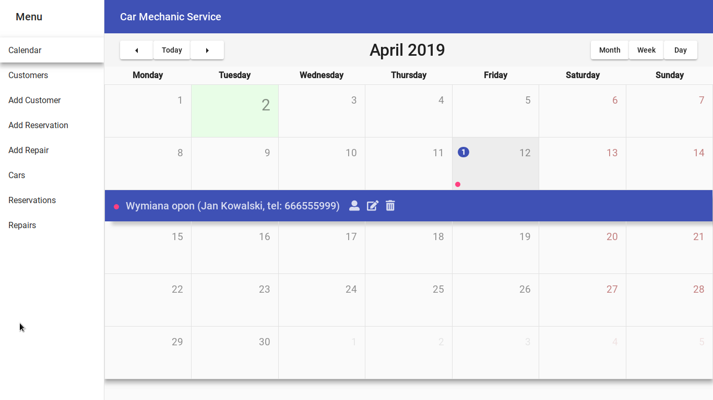
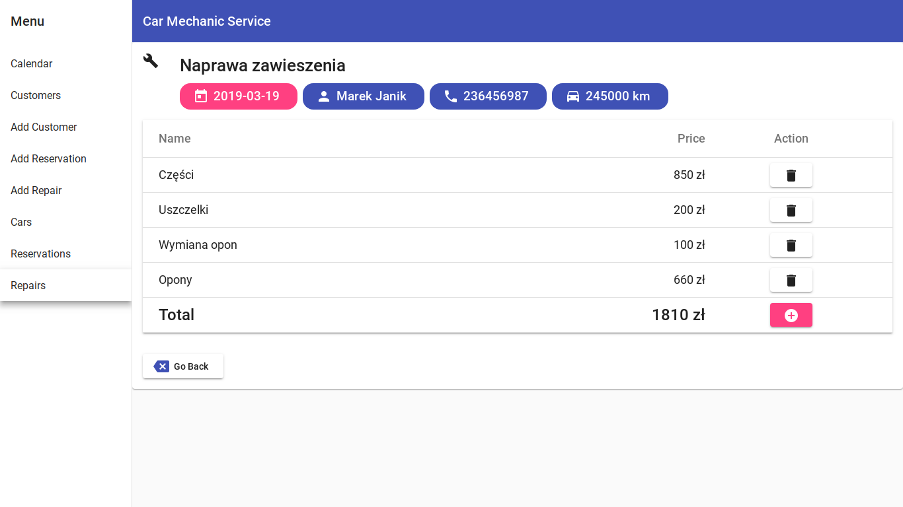
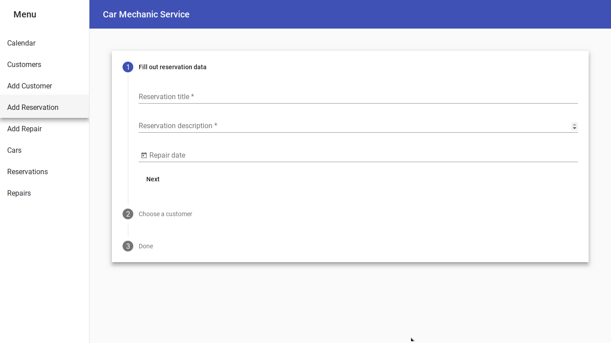

# CarMechanicServiceFrontend

This project was generated with [Angular CLI](https://github.com/angular/angular-cli) version 7.0.4.

## Screenshots

## General info
This is Angular frontend application with client-server architecture which can be used to monitor activities for customers, customer's reservations, cars and cars' repairs. It's all about create, update, delete and search all mentioned entites.

Software requirements are described with following use cases:

1. Create new customer
2. Update or delete customer
3. Create new customer's car
4. Update or delete car
5. Create new customer's reservation
6. Update or delete reservation
7. Create new car's repair
8. Update or delete repair
9. Create repair's element
10. Update or delete repair element

## Development server

Run `ng serve` for a dev server. Navigate to `http://localhost:4200/`. The app will automatically reload if you change any of the source files.

## Code scaffolding

Run `ng generate component component-name` to generate a new component. You can also use `ng generate directive|pipe|service|class|guard|interface|enum|module`.

## Build

Run `ng build` to build the project. The build artifacts will be stored in the `dist/` directory. Use the `--prod` flag for a production build.

## Running unit tests

Run `ng test` to execute the unit tests via [Karma](https://karma-runner.github.io).

## Running end-to-end tests

Run `ng e2e` to execute the end-to-end tests via [Protractor](http://www.protractortest.org/).

## Further help

To get more help on the Angular CLI use `ng help` or go check out the [Angular CLI README](https://github.com/angular/angular-cli/blob/master/README.md).

## Backend App
This application is related with the Java backend app:
[CarMechanicServiceBackend](https://github.com/katrinape/CarMechanicServiceBackend)

## Status
Project is: _in progress_

## Contact
Created by [@katrinape](https://www.linkedin.com/in/catherine-pe) - feel free to contact me!
